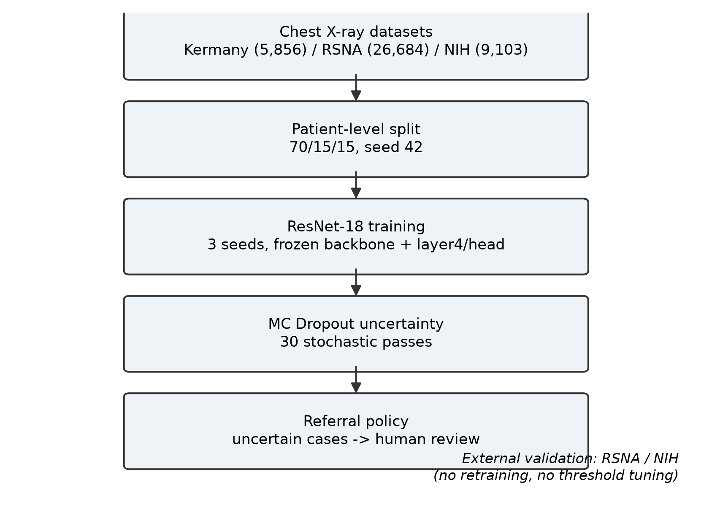
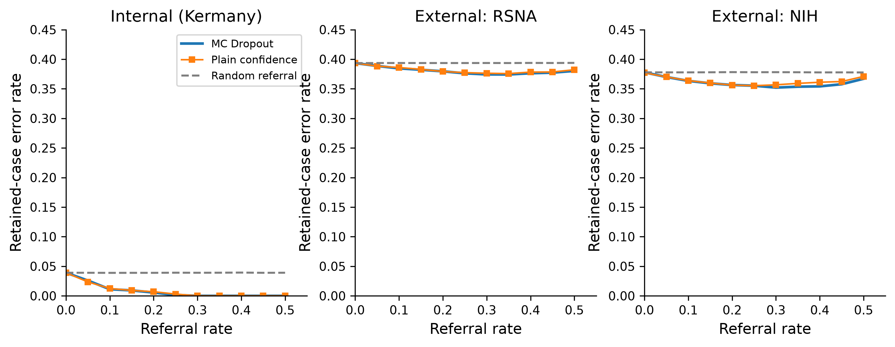
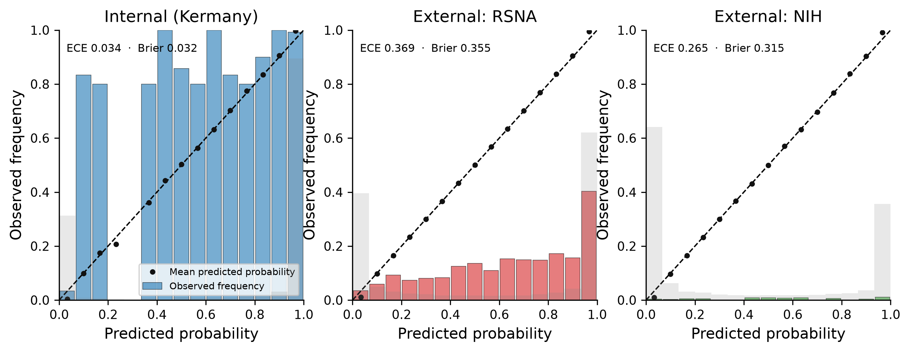
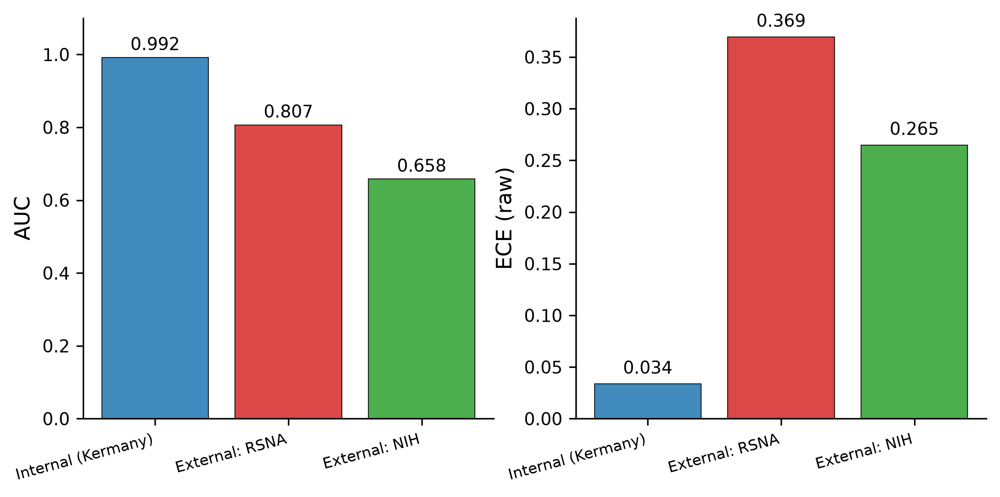
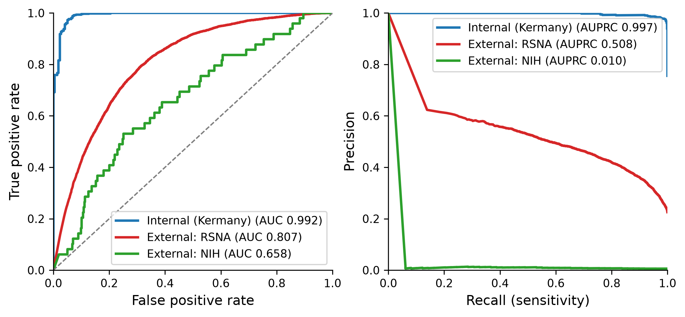
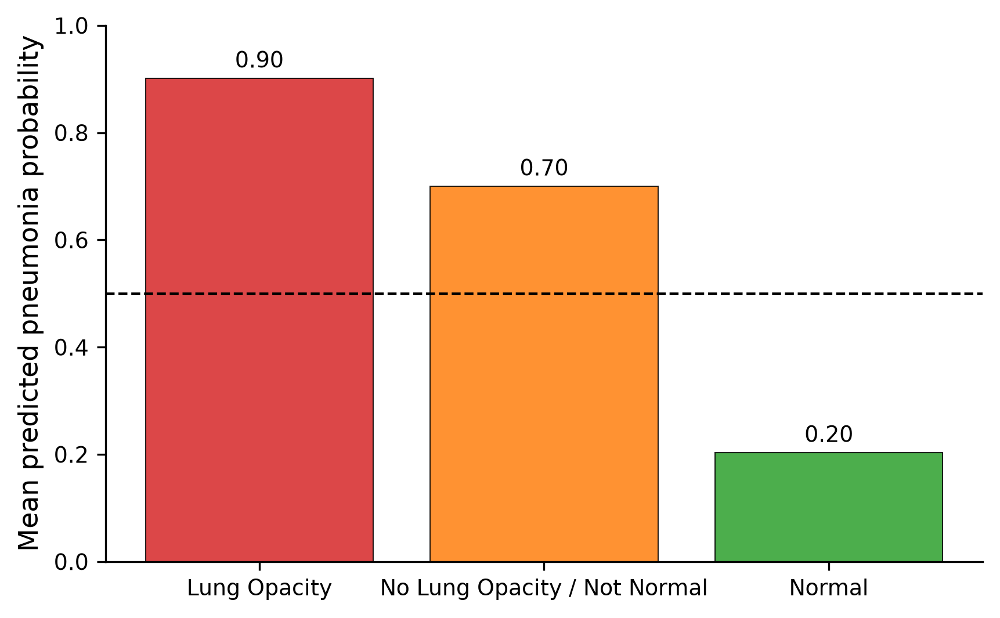

<div align="center">

# 🩻 MedKnow

## 教会医学 AI 何时说"我不知道"

**医学 AI 什么时候应该"承认自己不知道"？** —— 一个开源的医学影像不确定性与
选择性预测基准项目，核心发现是：不确定性转诊在域内有效，但在域漂移下失效。

[](https://huggingface.co/spaces/ojdanajakir848-a11y/medknow-pneumonia-xray)
[](https://colab.research.google.com/github/Solren-zhen/Medknow/blob/main/notebooks/medknow_colab.ipynb)
[](https://www.python.org)
[](https://pytorch.org)
[](LICENSE)
[]()
[](paper/output/doc/manuscript.md)

**[📄 手稿](paper/output/doc/manuscript.md)** · [English](README.md) ·
[🖥️ 在线 Demo](https://huggingface.co/spaces/ojdanajakir848-a11y/medknow-pneumonia-xray) ·
[🚀 Colab 一键演示](notebooks/medknow_colab.ipynb)

</div>

> ⚠️ **仅供科研与学习。** 本项目不是医疗器械，不能用于真实诊断。

---

## 🚀 快速开始（30 秒）

| 方式 | 入口 |
|---|---|
| **零安装演示** | [](https://colab.research.google.com/github/Solren-zhen/Medknow/blob/main/notebooks/medknow_colab.ipynb) — 加载权重、对示例胸片跑 MC Dropout 不确定性、画转诊曲线，免费 CPU/GPU 运行时 |
| **在线 Demo** | [🖥️ Hugging Face Space](https://huggingface.co/spaces/ojdanajakir848-a11y/medknow-pneumonia-xray) — 上传胸片即可看到预测 + 不确定性 + Grad-CAM |
| **本地安装** | `pip install -e ".[dev]" ` 或 `conda env create -f environment.yml` |

完整复现论文管线（数据 → 3 种子 → 不确定性 → 校准 → 转诊 → 外部验证 → 图表）见下文第 12 节。

## 1. 项目概述

MedKnow 是一个开源的医学影像不确定性与选择性预测评估框架项目，核心研究问题是：
**医学 AI 什么时候应该"承认自己不知道"？** 我们以 5,856 张胸部 X 线为内部
数据集，在患者级切分下训练 ResNet-18 肺炎分类器，并使用 3 个随机种子评估
预测不确定性是否能够识别不可靠的预测并将其转交人工复核。

结果呈现出明显的**域内/域外反差**：在内部数据分布下，将最不确定的 25%
病例转诊后，保留病例中的漏诊降至 0（主模型 seed 42；3 个种子最差不超过
0.2%；内部 AUC 0.992）；但当同一模型不做任何调整地迁移到两个独立外部队列
时，判别能力明显下降（RSNA AUC 0.807；NIH ChestXray-14 AUC 0.658），概率
校准显著恶化（ECE 0.034 → 0.369），而不确定性驱动的转诊策略不再优于随机
转诊。

核心结论：**模型在域漂移下可能"自信且错误"**，基于置信度或不确定性的医学
AI 分诊机制不能仅凭内部验证建立信任。

## 2. 研究问题

> 预测不确定性能否识别不可靠的胸片预测？这个信号在域漂移下还能存活吗？

这是*选择性预测/转诊*问题，不是"刷准确率"问题。基准把"我不知道"当作模型
一类可量化的输出。

## 3. 关键发现

1. **转诊在域内有效**：MC Dropout 不确定性可以按正确性给内部预测排序——
   10% 转诊率下保留集错误率从 4.0% 降到 1.4%，25% 降到 0.3% 且主分析中
   漏诊为零（相对随机对照 χ² = 9.56/16.30，P < 0.01）。
2. **转诊在域漂移下失效**：两个外部队列上不确定性信号与随机转诊无异
   （error-prediction AUC ≈ 0.5），校准崩溃（内部 ECE 0.034 vs RSNA 0.369）。
3. **这不是 MC Dropout 特有的失败**：纯置信度信号行为完全一致。

## 4. 研究设计

二分类肺炎分类器的回顾性评估：患者级切分、3 个训练种子、MC Dropout 不确定性、
带匹配随机对照的转诊分析、温度缩放校准、两个独立外部队列验证
（STARD 2015 / CLAIM 2020 / TRIPOD）。



## 5. 数据集

| 划分 | 数据集 | 图像数 | 阳性定义 | 患病率 |
|---|---|---:|---|---:|
| 内部 | Kermany 胸片集 | 5,856（测试 896） | 肺炎 | 75.6%（测试） |
| 外部1 | RSNA 肺炎检测挑战 | 26,684 | Lung Opacity | 22.5% |
| 外部2 | NIH ChestXray-14（二类） | 9,103 | 肺炎 | 0.5% |

患者级切分 70/15/15、seed 42：训练 4,076 张（2,222 患者）、验证 884（476）、
测试 896（476）。数据怪癖与评估口径见 [DATASET_NOTES.md](DATASET_NOTES.md)；来源与许可见 [data/README.md](data/README.md)。

## 6. 模型

ResNet-18（ImageNet 预训练），冻结骨干、微调 layer4 和带 Dropout 的分类头
（dropout 0.3）。AdamW（lr 1e-4、weight decay 1e-5）、batch 16、早停
（patience 5）、AMP，单卡 RTX 3060（PyTorch 2.5）。权重：
`checkpoints/seed_42.pth`、`seed_2024.pth`、`seed_2026.pth`。

## 7. 不确定性方法

统一接口 `estimate_uncertainty(model, loader, method)`，分数越高越不确定：

- `mc_dropout`：30 次随机前向，肺炎概率标准差（主估计器）
- `msp`：1 − 最大 softmax 概率（纯置信度）
- `entropy`：预测熵
- `random`：匹配率的随机对照
- `ensemble`：跨成员标准差（内部 epAUC 0.938、有效；外部 ≈ 随机、失效）

## 8. 转诊策略

在每个固定转诊率（0–50%）下，把最不确定的病例转人工复核，在保留集上测量
错误率、敏感度、FNR 和漏诊数；同率随机转诊作为对照，隔离"信号本身是否携带
正确性信息"。包含 error-prediction AUC 和 risk-coverage 曲线。



## 9. 校准

ECE（15 bins）与 Brier，raw 和温度缩放、域内和外部。温度缩放（T=1.67，内部
验证集拟合）能修复域内错校准，但**不能跨域迁移**：外部 ECE 仍约 0.36。
**温度缩放不是域自适应方法。**



## 10. 域漂移

三个队列通过统一接口评估，按队列协议记录在 `configs/`（`evaluation.protocols`）：
内部/RSNA 为单次前向 raw + label-rate ECE；NIH 为 MC 均值（30 次、T=1.67）
+ confidence ECE——与手稿口径完全一致。



## 11. 结果

与手稿逐项对照（seed_42，全部由 `scripts/medknow_evaluate_external.py` 再生成）：

| 指标 | 内部 | RSNA | NIH |
|---|---:|---:|---:|
| AUC | 0.992 | 0.807 | 0.658 |
| AUPRC | 0.997 | 0.514 | 0.010 |
| 准确率 | 96.1% | 60.7% | 62.3% |
| 敏感度 | 96.4% | 90.7% | 61.2% |
| 特异度 | 95.0% | 51.9% | 62.3% |
| ECE (raw) | 0.034 | 0.369 | 0.265 |
| Brier (raw) | 0.032 | 0.355 | 0.315 |

转诊（内部）：0% → 4.0% 错误率；10% → 1.4%；25% → 0.3%、漏诊为零
（seed_42 主分析；3 种子最差 ≤0.2%）。外部：转诊曲线与随机重叠。RSNA 亚组：
No Lung Opacity / Not Normal 组 70.0% 被判为肺炎，贡献 83.3% 的假阳性——
外部特异度低的主要来源。

 

转诊方法对比（25% 转诊 retained error）：域内三种信号都优于随机（随机 3.9% → MSP 0.3% / MC 0.15% / Ensemble 0.45%），MC 略优；域外全部失效（RSNA：随机 39.4% → MSP 37.7% / MC 37.6% / Ensemble 41.1%；NIH 类似）。复杂不确定性方法相比普通置信度没有优势，且任何基于置信度的信号都无法跨域保证 failure detection（见 [referral_methods_summary.json](results/tables/referral_methods_summary.json)）。

**验证状态：** 手稿全部数字已由新管线再生成并核对（见 [results/tables/manuscript_verification.md](results/tables/manuscript_verification.md)）；外部 MC 转诊与 Deep Ensemble 结果均来自新管线（[协议敏感性](results/tables/protocol_sensitivity.json)、[ensemble 汇总](results/tables/ensemble_summary.json)）；协议敏感性分析显示 AUC 对评估协议选择稳健（内部 0.992 / RSNA 0.807 / NIH 0.659）。

## 12. 复现实验

```bash
conda env create -f environment.yml        # 或 pip install -e ".[dev]"
conda activate medknow

python scripts/medknow_split_patient.py --seed 42  # 患者级切分
python scripts/medknow_train.py --config configs/baseline.yaml --seed 42
python scripts/medknow_evaluate.py --weights checkpoints/seed_42.pth
python scripts/medknow_run_calibration.py --weights checkpoints/seed_42.pth
python scripts/medknow_run_referral.py --weights checkpoints/seed_42.pth
python scripts/medknow_evaluate_external.py --weights checkpoints/seed_42.pth
python scripts/medknow_make_figures.py --weights checkpoints/seed_42.pth
```

## 13. 项目结构

```text
medknow/
├── src/medknow/
│   ├── datasets/       # 内部 / RSNA / NIH 加载器
│   ├── models/         # ResNet-18 工厂（手稿架构）
│   ├── training/       # 可复现训练 + 推理
│   ├── uncertainty/    # MC Dropout / MSP / entropy / random / ensemble
│   ├── calibration/    # ECE、Brier、可靠性图、温度缩放
│   ├── referral/       # 转诊曲线、risk-coverage、error-prediction AUC
│   ├── evaluation/     # 统一指标 + 亚组分析
│   └── visualization/  # fig01–fig08 生成器
├── configs/            # baseline / mc_dropout / temperature_scaling
├── scripts/            # 训练/评估/转诊/校准/作图
├── tests/              # 单元测试（74 个通过）
├── results/            # 图/表/指标（可再生成）
├── paper/              # 手稿、图、研究笔记
└── data/README.md      # 数据来源（不含任何影像）
```

## 14. 已知局限

- 内部数据单中心、偏儿科；外部结论受 RSNA/NIH 分布限制；
- NIH 队列仅 49 例阳性（0.5% 患病率），AUC 置信区间宽、NLP 标签噪声较大；
- 转诊阈值是启发式的，未在验证集上按目标转诊率校准；
- bootstrap CI 按图像而非患者重采样（内部测试集多图同患者，CI 偏乐观）；
- 无放射科医生对比；金标准为专家标签而非病理确诊；
- RSNA 未保留视图（AP/PA）元数据，无法分层分析视图混杂。

## 15. 引用

```bibtex
@software{medknow2026,
  author = {MedKnow authors},
  title  = {MedKnow: Teaching Medical AI When Not to Know},
  year   = {2026},
  url    = {https://github.com/Solren-zhen/Medknow}
}
```

## 16. 数据获取

本仓库不分发任何影像。来源与许可见 [data/README.md](data/README.md)
（Kermany / Kaggle、RSNA 竞赛、NIH ChestXray-14）。

## 17. 免责声明

仅供科研与学习使用，未经临床验证，不是医疗器械，不得用于诊断或治疗决策。

---

如果这个项目对你有帮助，欢迎点 ⭐ —— 它会告诉我们"诚实失败"值得被分享。
