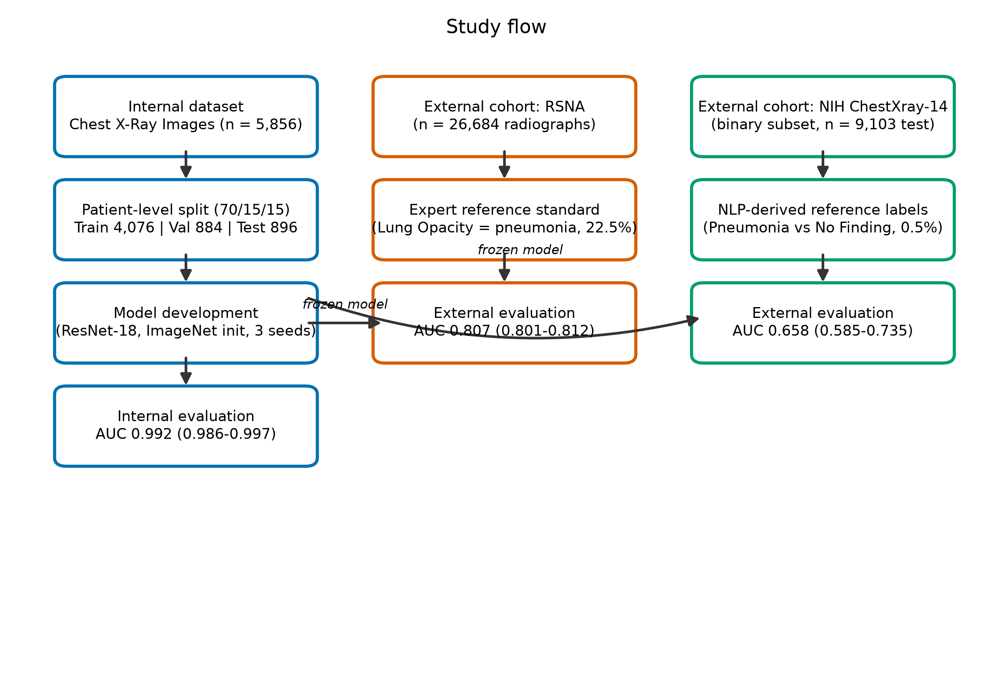
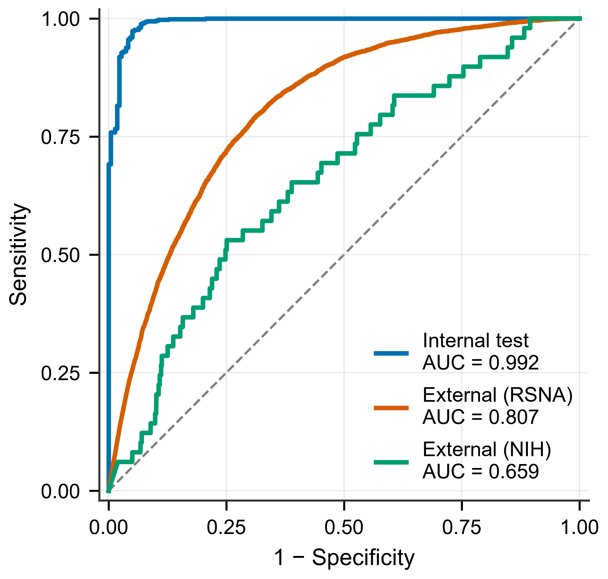
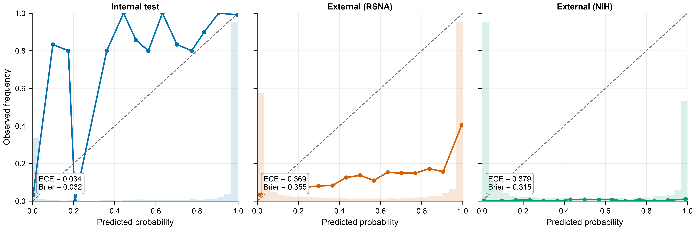
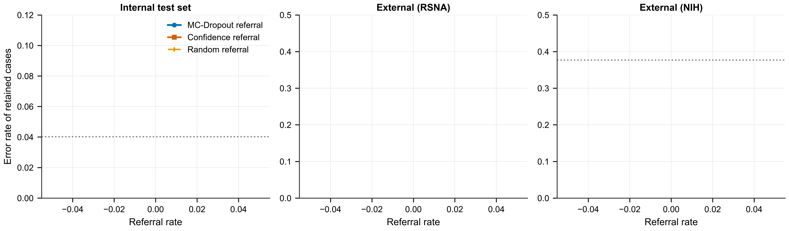
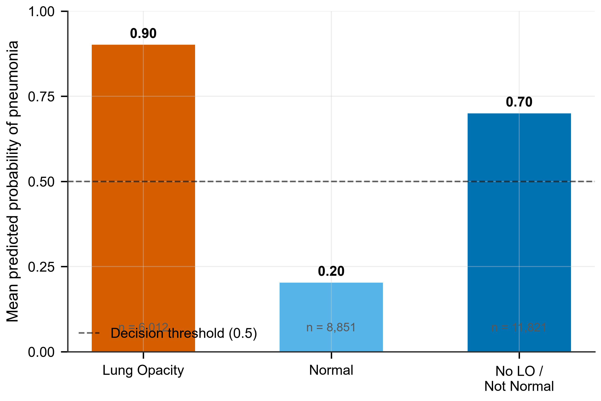

# 胸片肺炎筛查的不确定性引导转诊：域内改善分诊、跨机构域漂移下失效

## 摘要

**背景。** 肺炎是全球发病和死亡的主要原因之一 [@who-pneumonia]，胸部 X 光检查在许多场景下是一线影像学手段。肺炎检测深度学习模型常报告很高的内部准确率，但多数研究仅在单一机构数据上评估、不涉及不确定性引导的转诊机制，跨机构表现也缺乏刻画。预测不确定性能否可靠地引导低置信病例转交人工复核、以及该信号能否在域漂移下存活，仍不清楚。

**方法。** 我们在 5,856 张胸部正位 X 光片上使用患者级切分训练了 ResNet-18 分类器，采用三个随机种子。不确定性由 Monte Carlo Dropout（MC Dropout；30 次采样）估计，将高不确定预测转交人工复核的转诊策略与匹配转诊率下的随机转诊、以及普通置信度基线进行对照比较。模型在 RSNA 队列的 26,684 张图像和第二个独立外部队列（NIH ChestXray-14，9,103 张）上进行了外部验证。

**结果。** 内部测试 AUC 为 0.992（95% CI 0.986–0.997）。基于不确定性的转诊策略在 10% 转诊率时将保留集错误率从 4.0% 降至 1.4%，在 25% 时降至 0.3% 且无漏诊，而随机转诊无效。外部 AUC 在 RSNA 上为 0.807（ECE 0.369 vs 内部 0.034），在第二个 NIH 外部队列上为 0.658（95% CI 0.585–0.735）。两个外部队列上转诊均不再改善保留集准确率（如 RSNA 上 50% 转诊从 0.393 到 0.381）。内部转诊信号与普通模型置信度表现相当（误差预测 AUC 均约 0.93），在外部均无信息量。RSNA 低特异度（51.9%）主要源于将其他肺部异常判为肺炎（70%）。

**结论。** 不确定性引导的转诊在部署机构内有效，但不能跨域漂移迁移。用于跨机构部署的模型应在多中心数据上训练或适配，并结合临床特征，而非作为纯图像分类器使用。

**要点（Key points）**
1. 不确定性引导的转诊策略在 25% 转诊率下消除了保留预测中的漏诊（内部 AUC 0.992），但在两个独立外部队列上失效（RSNA AUC 0.807；NIH AUC 0.658）。
2. 失效并非 MC Dropout 所特有：基于普通置信度的转诊规则行为相同——域内有效、域漂移下失效。
3. 域漂移下判别力与校准均急剧恶化，划定了基于置信度的分诊机制可被信任的范围。

**关键词** 肺炎；胸片；深度学习；不确定性量化；Monte Carlo dropout；转诊；外部验证；域漂移

## 引言

肺炎是全球住院和死亡的主要原因之一 [@who-pneumonia]。胸部 X 光检查因其普及、廉价、且相对于 CT 辐射更少，是评估肺炎的一线影像学手段。在高通量和低资源场景中，影像解读需求常超过放射科医生供给，这推动了深度学习系统用于胸片分诊的研究兴趣 [@rajpurkar2017]。

近年胸片肺炎检测的深度学习模型常报告很高的内部准确率 [@kermany2018; @irvin2019; @rajpurkar2023]。大型公开胸片数据集的出现，包括 CheXpert [@irvin2019] 和 MIMIC-CXR [@johnson2019]，加速了该领域发展。然而多数这类研究只在单中心或单一数据集上进行、仅报告内部验证，且不刻画校准与预测不确定性。既往工作已表明肺炎分类器的跨机构表现差异显著 [@zech2018]，训练分布图像上测得的性能会高估真实采集差异下的表现。

对于旨在辅助而非取代临床医生的系统，自动分类器必须知道何时不应自主行动 [@kelly2019]。预测不确定性已被提议作为将低置信预测转交人工复核的依据 [@kompa2021; @begoli2019]：系统不对每张图像都给出自信标签，而是估计自身"不知道什么"，并把最不确定的病例转给人类阅片者。本文中"转诊"与"分诊"可互换使用，均指将不确定预测转交人类阅片者而非自动接受的工作流。原则上这使固定的准确率阈值变成可调的"安全阀"——机构自行决定转诊多少病例，保留集则是模型最有把握的部分。不确定性可通过多种方式估计——集成 [@lakshminarayanan2017]、测试时增强、或 Monte Carlo（MC）Dropout [@gal2016; @guo2017]。MC Dropout 在临床应用中尤为突出：无需改动架构，只需在推理时对训练好的模型随机采样，样本的离散度即为不确定性估计，计算代价适中。但诊断影像中不确定性引导转诊的证据仍然稀少，其域漂移（训练分布之外的图像）下的行为基本未经检验。部署机构需要一个具体答案：在训练地有效的转诊信号，迁移到不同采集环境后是否仍然成立？这正是本研究要回答的问题。

因此，我们从两方面评估了肺炎检测的 MC Dropout 不确定性转诊策略：其一，与匹配转诊率下的随机转诊相比，它是否改善机构内保留集的准确率；其二，这种改善能否在多个独立外部队列上存活。我们的预期是转诊在内部有效、但在域漂移下减弱，下述分析正是对这一预期的检验。

## 方法

### 研究设计

这是一项对胸片正位肺炎检测深度学习分类器的回顾性评估。目标有二：检验 MC Dropout 预测不确定性能否驱动将低置信预测转交人工复核的转诊策略，以及该策略能否跨机构泛化。我们在一个公共单中心数据集上以患者级切分开发和内部验证分类器，并在国立卫生研究院（NIH）的一个独立多机构数据集上进行外部验证。

全文以图像为分析单元。内部数据集是一组独立的胸部 X 光片；模型对每张图像产生一个预测；所有指标均在图像层面报告。患者级切分保证任何患者不会同时出现在训练集和测试集，但患者之间不做其他聚合——患者内图像相关对 bootstrap 置信区间的影响在讨论部分说明。本研究遵循诊断准确性研究报告标准（STARD）[@stard2015]、医学影像人工智能清单（CLAIM）[@claim2020] 以及个体预后或诊断多变量预测模型透明报告声明（TRIPOD）[@tripod2015]。

### 内部数据集

内部数据集是 Kermany 等描述的公开 Chest X-Ray Images 数据集 [@kermany2018]，含 5,856 张标记为肺炎或正常的胸部正位 X 光片。原始数据由数据集作者按图像级划分，这允许同一患者同时出现在训练集和测试集，从而虚高性能估计。为消除患者级泄漏，我们按患者标识（由文件名前缀推导）重新聚合全部图像，并以患者级（70/15/15）随机切分（种子 42）重新划分全队列。所得划分分别含 4,076 张图像（2,222 例患者）、884 张（476 例）、896 张（476 例）。测试集肺炎患病率为 75.6%（677 例肺炎对 219 例正常），反映原始数据集的不平衡性并原样保留而非重采样。该数据集来自单一机构的回顾性档案，以儿科人群为主 [@kermany2018]；图像覆盖了数据集核心对照所对应的正常与肺炎表现，标签中没有更细的肺炎亚型分类。

### 外部数据集

外部验证队列是 RSNA 肺炎检测挑战赛数据集 [@rsna2019]，含 26,684 张胸片正位图，由 NIH 临床中心和胸放射学会贡献。每张图像带有竞赛详细分类产生的专家标注图像级类别：Lung Opacity（肺炎证据）、No Lung Opacity / Not Normal、或 Normal。这些标注反映挑战赛组建的放射科医生专家组共识，而非单一阅片者，数据集设计旨在捕捉肺炎与其他致密影疾病之间、被二分类标签掩盖的诊断模糊性。我们将肺炎阳性定义为 Lung Opacity 标注，得到 6,012 张阳性图像（22.5%）；其余图像分为 11,821 张 No Lung Opacity / Not Normal 和 8,851 张 Normal。该队列来自比内部数据集更广泛、人口学更多样的患者群体，且采集于不同医院网络，为验证提供了真实的域漂移。外部队列仅用于评估；没有外部数据用于模型开发、验证集调参或阈值选择。

作为第二个独立外部队列，我们使用了 NIH ChestXray-14 数据集 [@nih2017] 的一个二分类子集，其中图像标注为 Pneumonia 或 No Finding。我们使用该数据集的预处理测试分区（9,103 张图像：49 张肺炎、9,054 张正常；肺炎患病率 0.5%），缩放到 224 × 224 像素。该队列在人群（成人，与内部以儿科为主的队列不同）、采集方式和标签来源（NLP 从放射报告提取，而非专家重新裁定）上均与内部数据不同，提供了又一个不同的域漂移测试。与 RSNA 队列一样，它仅用于评估，不做阈值调优。

### 参考标准

内部数据集的参考标准是数据集作者提供的肺炎/正常二分类标签 [@kermany2018]。外部数据集的参考标准是 Lung Opacity 的专家共识标注 [@rsna2019]。两个队列均无图像被排除。

### 模型开发

我们使用 ImageNet 预训练的 ResNet-18 卷积网络。选择 ResNet-18 是因为其轻量、适配可用算力（单块 RTX 3060，6 GB）、且是胸片分类中使用最广泛的骨干之一 [@rajpurkar2017]；在原始（图像级）切分上的初步比较中，其验证准确率不亚于甚至超过其他骨干，因而被保留为本研究患者级分析的主模型。我们没有进行系统的患者级架构比较；这一选择在"更强骨干可能提升绝对准确率"与"标准常用架构的透明性"之间做了权衡，权衡作为局限性说明。

卷积骨干被冻结，分类头替换为 dropout 层加二单元线性层；分类头与最后一个残差块被微调。该设计在 4,076 张图像的训练集上保持较小的可训练参数量、减少过拟合，同时允许最深层的卷积特征适应胸片领域。图像缩放至 224 × 224 像素，按 ImageNet 统计量归一化，训练期间使用随机旋转（±10°）、颜色抖动（亮度 0.2、对比度 0.1）和随机仿射平移（图像尺寸的 5%）进行增广。模型用 AdamW 优化器训练（学习率 1 × 10⁻⁴，权重衰减 1 × 10⁻⁵），批大小 16，验证损失早停耐心 5 个 epoch；训练全程在患者级验证集上监测验证损失。为刻画运行间变异，我们在固定患者级切分下用三个不同随机种子（42、2024、2026）训练模型，并额外训练两个解冻骨干模型（种子 42、2024）检验结果对骨干冻结选择的敏感性。训练在单块 NVIDIA RTX 3060 GPU 上使用 PyTorch 2.5 自动混合精度完成。

### 不确定性量化

预测不确定性使用 MC Dropout [@gal2016; @kendall2017] 估计。推理时启用 dropout 并进行 30 次随机前向传播；各次传播肺炎概率的均值作为最终预测，其标准差（std）作为不确定性估计。采样次数固定为 30，以在计算成本与估计器稳定性之间取得平衡。该估计器实现时将批归一化保持为评估模式，使仅由 dropout 引入的随机性贡献方差，而非批归一化训练模式下依赖数据的缩放。我们用标准差而非方差作为转诊统计量，因为它以概率单位表达，可解释为围绕均值预测的置信带；两个统计量产生相同的不确定性排序，从而产生相同的转诊曲线。

### 转诊策略

转诊规则很简单：设定一个标准差阈值；任何不确定性超过该阈值的病例被转交人类阅片者，而不是作为自动答案接受。在整个观测不确定度范围内扫描阈值，绘制转诊-错误权衡曲线——每一步记录转诊率（转交复核的病例比例）以及保留自动处理病例中的错误率和漏诊率。由于不确定度分布的形态决定了阈值如何转化为转诊率，我们以固定转诊率（0%、5%、10%、……、50%）而非固定标准差数值报告结果，使不同不确定度尺度的队列之间曲线可比。作为对照，我们在相同转诊率下运行随机转诊策略——随机转交等大小的子集——并重新计算保留集错误。在匹配转诊率下比较基于不确定性与随机的曲线，可分离不确定性信号本身是否携带关于正确性的信息，而不仅仅是移除病例的效果。作为进一步参照，我们还基于模型的普通置信度而非 MC Dropout 变异性构建了一条转诊规则：离 0.5 决策边界最近（MC-mean 概率置信度最低）的病例先被转诊。这条普通置信度曲线用于说明转诊信号是 dropout 引入的变异性所特有的，还是已经存在于模型自身的预测置信度中。

转诊决策与保留病例的分类基于 MC Dropout 均值概率（温度缩放 T = 1.67）以 0.5 为阈值判定；因此转诊分析中基线（0% 转诊）错误率反映的是这一 MC-mean 协议，与上文报告的单次前向分类错误率略有不同。所有转诊指标——包括基于不确定性和随机策略的——均在该单一协议内计算，因此不同转诊率之间及与随机转诊的比较在内部是一致的。

### 统计分析

判别能力用受试者工作特征曲线下面积（AUC）量化，95% 置信区间（CI）通过对测试图像 2000 次 bootstrap 重采样（图像级放回抽样）获得；同时报告精确率-召回率曲线下面积（AUPRC）。校准用期望校准误差（ECE）[@guo2017; @nixon2019] 量化，在 15 个概率区间上计算预测概率与各区间内观测频率之差的绝对值的按样本量加权均值；同时报告 Brier 分数，即预测概率与二分类标签之间均方误差。两项校准指标均在原始（未缩放）类概率上计算，使内部与外部值可直接比较；外部 ECE 的温度缩放变体在讨论部分报告，用以量化事后重校准能恢复和不能恢复的内容。我们在默认工作点 0.5 报告敏感度、特异度和准确率。三个种子模型的所有指标以均值 ± 标准差（SD；样本 SD，n − 1 自由度）汇总。10% 与 25% 转诊率下基于不确定性与随机转诊的保留集错误计数差异，以保留预测正确/错误 2 × 2 列联表行双侧卡方比例检验。每个转诊信号的信息含量用误差预测 AUC 量化，定义为以该信号（MC Dropout 标准差或普通置信度）作为"预测是否出错"的预测因子时的受试者工作特征曲线下面积。外部队列未对转诊效应进行正式检验：基于不确定性与随机的曲线在所有转诊率下均重叠，且未预先设定方向性备择假设，因此外部比较以描述性方式报告。分析使用 Python 3.11 的 scikit-learn 与 SciPy 完成，模型推理使用 PyTorch 2.5 在 NVIDIA RTX 3060 上进行。

## 结果

### 数据集特征

内部队列含 5,856 张胸片，按患者重新分组并划分为训练（4,076 张来自 2,222 例）、验证（884 张来自 476 例）和测试（896 张来自 476 例）集（表 1）。内部测试集肺炎患病率为 75.6%。外部 RSNA 队列含 26,684 张图像，其中 6,012 张（22.5%）标注为 Lung Opacity（肺炎），11,821 张为 No Lung Opacity / Not Normal，8,851 张为 Normal（表 1、图 1）。

### 内部测试性能

在内部测试集上，分类器 AUC 为 0.992（95% CI 0.986–0.997），AUPRC 为 0.997（表 2、图 2）。在默认 0.5 阈值下，准确率 96.1%，敏感度 96.4%，特异度 95.0%，896 张图像中 24 例假阴性和 11 例假阳性。温度缩放前 ECE 为 0.034，Brier 分数 0.032（图 3）。

### 运行间稳定性

在固定患者级切分下，三个训练种子（42、2024、2026）的内部测试 AUC 为 0.9925 ± 0.0007，AUPRC 0.9974 ± 0.0002，准确率 0.965 ± 0.008，ECE 0.029 ± 0.007，Brier 分数 0.028 ± 0.005（表 3）。变异的主要来源不是训练过程，而是工作阈值与较少的错误数：三个种子的测试集分别含 23 至 37 个错误，最佳与最差种子的准确率差异（0.9743 vs 0.9587）对应 896 张图像中约 14 张。解冻骨干训练的模型 AUC（种子 42 为 0.9962、种子 2024 为 0.9946）略高于冻结骨干对应值，但处于小数据集去正则化后预期的范围内；我们保留冻结骨干设置为主设置，因为它更保守且更贴合典型部署地的算力约束。内部转诊结果在三个种子上同样稳定：10% 转诊率下保留集错误率在 0.7%–1.4% 之间（匹配转诊率下随机转诊为 2.6%–3.9%）；25% 转诊率下为 0.1%–0.3%，保留集漏诊率至多 0.2%（种子 2026 为 1 例，种子 42 与 2024 为 0 例；表 S1）。

### 内部转诊策略

在内部测试集中，MC Dropout 基于不确定性的转诊规则将保留集错误率从 0% 转诊时的 4.0% 降至 10% 转诊时的 1.4%，25% 转诊时降至 0.3%，此时保留集漏诊率为零（图 4）。相同转诊率下的随机转诊基本不改变保留集错误率（10% 时 3.9%，25% 时 3.4%）。两种转诊率下基于不确定性与随机转诊的差异均具有统计学显著性（10% 时 χ² = 9.56，P = 0.002；25% 时 χ² = 16.30，P < 0.001）。曲线有两个值得指明的性质。第一，收益集中在前四分之一转诊：10% 点时保留集错误率已下降三分之二，25% 时已接近零，因此显著高于 25% 的转诊率几乎不再增益。第二，转诊的并非只是"难但有解"的病例——由于保留集漏诊率达到零，转诊通道捕获了每一个本会被漏诊的肺炎病例，而这正是一个以安全为导向的分诊工具所需的性质。

### 外部验证

在外部 RSNA 队列上，分类器 AUC 为 0.807（95% CI 0.801–0.812），AUPRC 为 0.514（表 2、图 2）。在 0.5 阈值下，准确率 60.7%，敏感度 90.7%，特异度 51.9%。校准显著恶化，ECE 0.369（内部为 0.034），Brier 分数 0.355（图 3）。工作点值得说明：0.5 阈值原样沿用内部分析，外部特异度 51.9% 是该固定阈值在不同患病率与标签分布下的性质，而非模型排序能力的性质——后者由 AUC 0.807 反映。按外部分布调优阈值会在敏感度与特异度之间交易并显著改变报告的准确率；我们报告固定阈值结果，以反映不带本地阈值再优化的模型部署这一现实场景，并将在讨论部分回到这一点。

### 外部亚组分析

在外部队列中，6,012 张 Lung Opacity 图像的平均预测肺炎概率为 0.901（90.7% 判为肺炎），8,851 张 Normal 图像为 0.203（18.7% 判为肺炎），11,821 张 No Lung Opacity / Not Normal 图像为 0.700（70.0% 判为肺炎）（图 5）。按亚组分解 9,936 例假阳性，可确认特异度损失来自何处：标注为 No Lung Opacity / Not Normal 的图像贡献了其中 8,280 例（83.3%），而真正的 Normal 图像仅贡献 1,656 例（16.7%）。换言之，分类器并非普遍过度判阳——它专门把肺炎与共享其影像外观的其他致密影混淆，而二分的"正常 vs 肺炎"框架完全掩盖了这一点。这也解释了为何外部特异度无法通过任何保持敏感度的阈值恢复：No Lung Opacity 亚组的平均预测概率为 0.70，恰在决策边界的肺炎一侧，因此任何单一标量阈值都无法将其与真肺炎干净分离。

### 外部转诊策略

在外部队列中，基于不确定性的转诊规则将保留集错误率从 0% 转诊时的 0.393 降至 50% 转诊时的 0.381，与随机转诊对照相当（50% 时为 0.387）（图 4）。与内部曲线的对比是鲜明的：内部转诊四分之一病例将保留集错误率降低了 90% 以上；外部转诊一半队列仅降低三个百分点，且随机转诊表现相同。MC Dropout 标准差能区分内部预测的对错，在外部图像上却几乎不携带此类信号。事后看这在意料之中：dropout 不确定性反映模型对自身随机性的敏感度，仅当模型的运行域与其训练域一致时才对决策置信度有信息量。在域漂移下，模型对从未以正确分布见过的输入——统一地——很自信，不确定性估计不再跟踪正确性。

### 第二个外部队列（NIH ChestXray-14）

在第二个独立外部队列（9,103 张图像；肺炎患病率 0.5%）上，AUC 为 0.658（95% CI 0.585–0.735），AUPRC 为 0.010（表 2、图 2）；在固定 0.5 阈值下，敏感度 61.2%、特异度 62.3%。校准再次显著劣化（原始 ECE 0.265、Brier 0.315；表 2、图 3）。基于不确定性的转诊规则再次未能将剩余错误率改善到随机转诊之上（如 25% 转诊时 0.354，随机为 0.378；图 4）。这个标签来源不同的第二个外部队列（NLP 提取的 Pneumonia vs No Finding，成人人群）从而复现了 RSNA 的发现：在内部能干净区分预测对错的不确定性排序，在域漂移下不再携带此类信息。

### 转诊信号基线：MC Dropout vs 普通置信度

为检验转诊信号是否由 MC Dropout 变异性所特有，我们将其与按普通置信度转诊的规则（MC-mean 概率置信度最低者先转诊）比较。在内部，两个信号几乎等同：作为"预测是否出错"预测因子的误差预测 AUC，MC Dropout 标准差为 0.931，普通置信度为 0.933，转诊曲线相近，MC Dropout 在中低转诊率略优（10% 转诊时保留错误 0.0112 vs 0.0136；25% 时 0.0015 vs 0.0030）。在 NIH 外部队列上，两个信号都无信息量（误差预测 AUC ≈ 0.5，转诊曲线平坦且与随机重叠）；在 RSNA 上，基于不确定性和普通置信度的曲线都平坦且与随机转诊相当。转诊收益因此并非 MC Dropout 估计器的假象：基于普通置信度的转诊规则行为相同——域内有效、域漂移下失效——失效是"用模型置信度作为陌生分布下正确性信号"这一特性的普遍属性，而非特定不确定性估计器的属性。

## 表格

### 表 1. 数据集特征

| | 内部（Kaggle） | 外部（RSNA） | 外部（NIH） |
|---|---|---|---|
| 图像总数 | 5,856 | 26,684 | 9,103（测试） |
| 切分（患者） | 训练 2,222 / 验证 476 / 测试 476 | — | — |
| 测试图像（患病率） | 896（75.6%） | 26,684（22.5% Lung Opacity） | 9,103（0.5% 肺炎） |
| 阳性类别 | 肺炎 | Lung Opacity | 肺炎 |
| 来源 | Kermany 等 2018 | NIH 临床中心 | NIH（NLP 标签） |

### 表 2. 模型性能

| 指标 | 内部测试 | 外部（RSNA） | 外部（NIH） |
|---|---|---|---|
| AUC（95% CI） | 0.992（0.986–0.997） | 0.807（0.801–0.812） | 0.658（0.585–0.735） |
| AUPRC | 0.997 | 0.514 | 0.010 |
| 准确率 | 96.1% | 60.7% | 62.3% |
| 敏感度 | 96.4% | 90.7% | 61.2% |
| 特异度 | 95.0% | 51.9% | 62.3% |
| ECE（原始） | 0.034 | 0.369 | 0.265 |
| Brier 分数（原始） | 0.032 | 0.355 | 0.315 |

### 表 3. 运行间稳定性（3 种子，内部测试）

| 指标 | 种子 42 | 种子 2024 | 种子 2026 | 均值 ± SD |
|---|---|---|---|---|
| AUC | 0.9919 | 0.9924 | 0.9933 | 0.9925 ± 0.0007 |
| AUPRC | 0.9971 | 0.9973 | 0.9977 | 0.9974 ± 0.0002 |
| 准确率 | 0.9609 | 0.9743 | 0.9587 | 0.9646 ± 0.0084 |
| ECE（原始） | 0.0335 | 0.0213 | 0.0334 | 0.0294 ± 0.0070 |
| Brier（原始） | 0.0316 | 0.0225 | 0.0291 | 0.0277 ± 0.0047 |

## 讨论

本研究提出了一个问题：MC Dropout 不确定性能否驱动肺炎检测的转诊策略，以及该策略能否跨机构维持。在单一机构内，答案显然是能：转诊 25% 最不确定的病例消除了保留预测中的漏诊，而相同转诊率下的随机转诊毫无作用。在两个独立外部队列上，答案同样明确是不能：判别力与校准急剧恶化，不确定性信号不再区分预测的对错。由此浮现的模式是：不确定性感知的转诊在部署机构内是真实的人机协作机制，但其价值无法跨域漂移迁移，且纯图像模型仍容易将肺炎与其他肺部异常混淆。

将不确定性作为人工复核触发点的框架此前已有阐述。Kompa 等提出机器学习系统应向临床决策沟通预测不确定性，并主张高不确定预测应转交人工而非自主行动 [@kompa2021]。我们在诊断影像任务中为这一提议提供了直接的经验支持，并量化了改进：10% 转诊率时保留集错误率从 4.0% 降至 1.4%，25% 时降至 0.3% 且零漏诊；两者相对随机转诊均具有统计学显著性。既往的转诊研究大多在单一域内、通过汇总统计量将基于不确定性的规则与随机转诊对照——例如 Zhang 等引入的 AR 统计量，即转诊曲线相对随机转诊曲线下的面积比 [@zhang2023]，应用于糖尿病视网膜病变筛查。据我们所知，在独立外部队列上同时报告匹配转诊率下的完整转诊-错误率曲线、并与随机转诊对照，尚未见报告；正是这种匹配率对照确立了不确定性信号——而非仅仅移除病例——对改进负责。使证据干净的正是这一设计细节：对转诊曲线的朴素解读可能将改进归因于移除了部分数据，但匹配转诊率下的随机转诊曲线表明，不考虑不确定性地移除数据毫无作用。是两条曲线的配对，而非转诊曲线本身，证明了不确定性信号携带关于预测正确性的信息。

本研究第二个、较少被报告的贡献是：同样的对照比较在域外失效。转诊框架通常在单一数据集内评估，信号能否在迁移中存活很少用匹配的随机对照来检验。我们的外部结果——在两个独立外部队列（RSNA 和 NIH ChestXray-14）上均复现——表明不能：内部干净地区分预测对错的不确定性排序，在两个外部队列上几乎都不具信息量 [@ovadia2019]。这是一个阴性结果，但对部署机构很有用，因为它划定了该机制可被信任的范围。我们认为显式报告失败模式与报告成功同等重要，因为只含阳性转诊结果的文献无法为后续研究者校准预期。

本研究分析启动以来，已有多个团队报告了肺炎筛查的不确定性感知框架——如将 MC Dropout 与可解释性结合的 EfficientNet 筛查器（Ayub 等，2026 [@ayub2026]），或在胸片分类任务上对比 MC Dropout 与集成方法（Whata 等，2024 [@whata2024]）。这些工作与我们有共同的动机——用预测不确定性标记需要专家复核的病例——但大多仅在单一数据集内评估。相对于这一新兴文献，我们的贡献在于受控对照本身：同时确立转诊信号在域内改善分诊、以及它无法跨机构迁移，而非不确定性估计器或分类器架构本身的新颖性。

外部判别力下降与既往胸片分类器泛化变异的报告一致。Zech 等证明肺炎检测深度学习模型在机构间表现差异显著，并将其归因于采集特异与人群特异的混杂因素 [@zech2018; @pooch2020]。我们的结果从两方面延伸了这一模式。其一，AUC 从内部 0.992 降至外部 0.807，证实即使高度优化的内部模型在采集变化下也会损失可观的判别力。其二——更引人注目——校准从 ECE 0.034 崩溃至 0.369。这两者中校准失败对部署影响更大：它表明在训练分布内校准良好的模型在域漂移下可能变得显著过度自信，这一性质无法仅凭判别指标刻画，而对任何以预测概率驱动决策或阈值的部署都至关重要。该结果也限定了标准补救措施的适用性。温度缩放，即我们内部应用的事后校准方法 [@guo2017]，在分布内验证集上拟合单个标量，且按构造无法在输入分布偏移后恢复校准。在我们的数据中，内部拟合的温度（T = 1.67）使外部 ECE 基本不变（温度缩放后 0.3605 vs 原始 0.3692），证实外部过度自信不是标量变换可修正的概率尺度失校，而是系统性分布失配。这与更广泛的观察一致：校准是模型在特定人群上的属性，而非模型本身单独拥有的属性。视图位置（AP/PA）近来被指认为胸片 AI 跨数据集性能差异的主要驱动因素之一；我们无法按视图分层，因为 RSNA 图像在从 DICOM 转换时未保留视图元数据、而 NIH 外部队列每个视图的肺炎正例太少，但视图类型混杂仍是我们观察到的外部劣化的可能贡献因素之一。

我们的发现也与塑造这一领域的大规模胸片数据集并置。CheXpert [@irvin2019] 和 MIMIC-CXR [@johnson2019] 的构建正是因为单数据集训练泛化不佳，它们能在内部队列无法企及的规模上支持多中心开发。我们不主张转诊框架与在此类语料上训练的模型具有竞争力；贡献在于方法学。一个小的、公开可得的训练集——资源有限中心能现实地组建的那种——结合明确的转诊机制与诚实的外部验证，足以同时确立不确定性引导转诊的内部价值及其在域漂移下的脆弱性。定量教训（转诊在域内有效、域外失效）是可迁移的发现，而这恰恰是只报告分布内准确率的大队列研究无法揭示的。

外部低特异度（51.9%）主要源于标注为 No Lung Opacity / Not Normal 的图像亚组，其中 70% 被判为肺炎，而 Normal 图像有 81.3% 判对。这一模式反映了纯图像分类的根本局限：在胸片上，肺炎与其他肺部异常（如实变、肺不张、其他病因的肺致密影）形态上重叠，没有临床或实验室信息，模型无法消解这种模糊性。该发现支持影像与临床特征结合的多模态方法，也支持外部验证按亚组分别报告性能而非折叠进二分类阴性类。

回到工作阈值：我们的外部准确率数字在内部 0.5 阈值下计算，读者可能合理追问模型在本地阈值再优化后能达到多少。由于 AUC 0.807 独立于阈值地概括排序性能，在外部数据上再优化阈值会沿 ROC 曲线移动报告的工作点，但不会改变模型无法将 No Lung Opacity 与真肺炎分离这一根本局限——亚组平均概率（0.70 vs 0.90）实在太接近。阈值选择还有一个纯内部研究通常忽略的代价：在外部数据上选择阈值要用到外部标签，而在真实的部署场景中，这些标签正是新机构需要参考标准才能获得的信息。因此我们认为固定阈值结果——而非再优化结果——是开箱即用部署的诚实描述，并强调任何部署决策都应基于完整的 ROC 与转诊曲线，而非单一阈值点。

综合来看，本研究的两半结果描述了机构在部署不确定性感知分类器前后应作和不应作哪些假设。在模型开发机构内部，转诊机制是可行的分诊工具：10% 转诊率时，70 个保留预测中只有 1 个错误；25% 时保留集无漏诊肺炎。实践中这意味着阅片者复核约四分之一的病例，原则上即可放心把其余病例导向低干预路径。但外部结果是警示性的一半。将同一模型原样部署到新机构会复现我们测得的失败：转诊信号不比随机更好，低特异度亚组以非肺炎致密影淹没阳性通道，而内部评估曾校准到 3.4 个百分点以内的预测概率，会误导近 37 个百分点。因此对部署团队，我们的结果建议任何上线决策前采取三个具体步骤：在本地数据上重新估计工作阈值，在本地留出集上重新验证不确定性信号，并在可行时用本地图像重校准或重训练。仅凭内部验证的强度，这些步骤一步都不能省 [@abramoff2018]。

本研究的局限需逐一说明。第一，三个数据集构成全部证据基础：一个单一、公开、以儿科人群为主的内部数据集，和两个外部来源（RSNA 与 NIH ChestXray-14）。第二个外部队列肺炎正例少（9,103 张中 49 张）、极度不平衡（患病率 0.5%），且标签为 NLP 提取，已知比专家重新裁定更噪；其 AUC 估计置信区间较宽，性能降幅的数值应谨慎解读。三者都是领域内使用最广泛的资源，这有助可比性，但泛化性结论受这些分布限制，第三个采集环境的行为可能与它们都不同。第二，转诊阈值是启发式选择的，未在验证集上向目标转诊率校准。实际工作点需要前瞻性规定：机构应根据自身工作量和可接受的残余风险选择转诊率，标准差阈值再从本地数据推导。我们精确报告整条曲线正是为了让这种选择成为可能，但我们没有在此替机构做出选择。第三，本研究仅评估单一架构（ResNet-18），未进行患者级替代骨干对比。该架构因轻量且广泛验证而被选中，但更强骨干可能改变报告效应的量级，我们的结果不应被解读为具体数值增益与架构无关。第四，bootstrap 置信区间通过对图像重采样而非患者重采样计算。由于内部测试集每例患者含多张图像，这些区间未充分考虑患者内相关；同一患者的图像并不独立，患者级重采样会加宽区间。点估计不受影响，但报告的 CI 应视为乐观。第五，本研究未纳入与放射科医生表现的对比，参考标准是专家标签而非病理学证实。要确立转诊机制相对现有实践的临床价值主张，需要与人类阅片者的头对头对比 [@liu2019]；我们的数据说明的是机制内部的一致性，而非其对放射科医生的优越性。第六，外部参考标准将 No Lung Opacity 视为阴性，而这些图像可能含其他有临床意义的异常；这一标签语义促成了观测到的特异度，应相应解读。此问题严重性因我们的亚组分析而部分缓解——亚组分析将 Normal 与 No Lung Opacity 分开而非折叠为单一阴性类——但二分类标签仍是对临床现实的简化。

## 结论

MC Dropout 转诊策略能在部署机构内可靠地将低置信肺炎预测转交人工复核，在 25% 转诊率下消除保留预测中的漏诊——但不确定性信号与判别力、校准一样，无法跨域漂移迁移。因此信息是有条件的：在训练机构内，不确定性引导转诊是效应大且统计稳健的可行安全机制；在别处，必须先重新验证、重新定阈值，并很可能重校准或重训练后才能信任。用于跨机构部署的模型应在多中心数据上训练或适配，并结合临床特征，而非作为纯图像分类器使用。

## 缩略语

AUC：受试者工作特征曲线下面积；AUPRC：精确率-召回率曲线下面积；CI：置信区间；ECE：期望校准误差；FNR：假阴性率；MC：Monte Carlo；NLP：自然语言处理；ROC：受试者工作特征曲线；RSNA：北美放射学会。

## 声明（Declarations）

**伦理审批与知情同意**
不适用。两个数据集均为公开研究资源，仅以去标识形式使用；因此本研究依据适用法规无需机构审查委员会批准。

**同意发表**
不适用。

**数据与材料可获取性**
内部数据集（Chest X-Ray Images，5,856 张胸片正位图）是 Kermany 等描述的公共资源 [@kermany2018]，按其原始许可在 Kaggle 分发（https://www.kaggle.com/paultimothymooney/chest-xray-pneumonia）。外部 RSNA 队列（26,684 张胸片正位图）由 Shih 等描述 [@rsna2019]，按其竞赛使用条款获取（https://www.kaggle.com/c/rsna-pneumonia-detection-challenge）。第二个外部队列是 NIH ChestXray-14 数据集 [@nih2017] 的二分类子集。分析代码、患者级切分定义和模型权重可向通讯作者合理索取；录用后将在公共代码仓库公开。

**利益冲突**
作者声明无利益冲突。

**基金**
本研究未获得公共、商业或非营利部门的任何专项基金资助。

**作者贡献**
[由作者填写。]

**致谢**
不适用。

**人工智能的使用**
人工智能语言模型（Claude, Anthropic）用于协助起草和润色手稿文本并组织分析流程。所有生成内容均经作者对照源数据严格审阅与核实，作者对最终内容负全责。模型未参与研究设计、数据收集或结果解释。

## 图注

**图 1.** 研究流程图。内部 Chest X-Ray Images（Kermany）数据集按患者重新分组并在患者级切分（70/15/15，种子 42）；ResNet-18 分类器以三个随机种子训练，并在留出的测试分区上内部评估。随后该模型在不重训练、不优化阈值的情况下应用于两个独立外部队列（RSNA 与 NIH ChestXray-14），进行判别、校准、亚组与转诊分析。

**图 2.** 内部测试集（AUC 0.992，95% CI 0.986–0.997）、外部 RSNA 队列（AUC 0.807，95% CI 0.801–0.812）与第二个外部 NIH 队列（AUC 0.658，95% CI 0.585–0.735）的受试者工作特征曲线。虚线对角线表示随机表现。

**图 3.** 内部测试集（左）、外部 RSNA 队列（中）与外部 NIH 队列（右）的可靠性图，在原始类概率上以 15 个区间计算。对角线以上的点表示过度自信。各队列显示期望校准误差（ECE）与 Brier 分数；各面板底部阴影区域显示预测概率分布。左：ECE 0.034、Brier 0.032；中：ECE 0.369、Brier 0.355；右：ECE 0.265、Brier 0.315。

**图 4.** 内部测试集（左）、外部 RSNA 队列（中）与外部 NIH 队列（右）的转诊-错误权衡曲线。实线为基于 MC Dropout 的转诊；方块标记为按普通模型置信度转诊；虚线为匹配转诊率下的随机转诊。错误率在保留的自动分类病例中计算。内部面板中，星号标记 10% 与 25% 转诊率，此处基于不确定性的转诊显著优于随机转诊（χ² = 9.56，P = 0.002；χ² = 16.30，P < 0.001）。两个外部面板中三条曲线在所有转诊率下重叠。内部面板中，MC Dropout 信号在 10% 与 25% 转诊率下保留的错误少于普通置信度（保留错误率 0.0112 vs 0.0136、0.0015 vs 0.0030）。

**图 5.** RSNA 队列的外部亚组表现。柱状图显示标注为 Lung Opacity（n = 6,012）、No Lung Opacity / Not Normal（n = 11,821）与 Normal（n = 8,851）图像的平均预测肺炎概率，柱顶标注数值；水平虚线标记 0.5 分类阈值。
